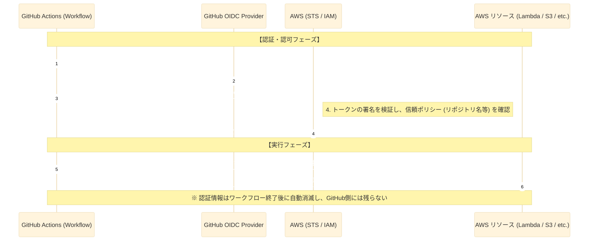

# GitHub Actions & AWS OIDC 連携シーケンス

この図は、GitHub Actions が AWS アクセスキーを使用せずに、セキュアに AWS へのアクセス権限を取得するフローを示しています。

## 各ステップの解説

1.  **JWTリクエスト**: ワークフロー内で `permissions: id-token: write` を設定することで、GitHub Actions がトークンを取得可能になります。
2.  **証明書発行**: このトークンには「どのリポジトリのどのブランチから実行されているか」という情報（Claims）が署名付きで含まれます。
3.  **信頼の検証**: AWS 側の IAM OIDC プロバイダーが GitHub の署名を検証します。さらに、IAM ロールの「信頼関係」設定により、特定のリポジトリからの要求のみを受理します。
4.  **一時的な鍵**: 発行されるのは数十分〜数時間だけ有効な「使い捨ての鍵」です。万が一漏洩しても、時間が経てば無効化されるため、固定のアクセスキーよりも格段に安全です。
