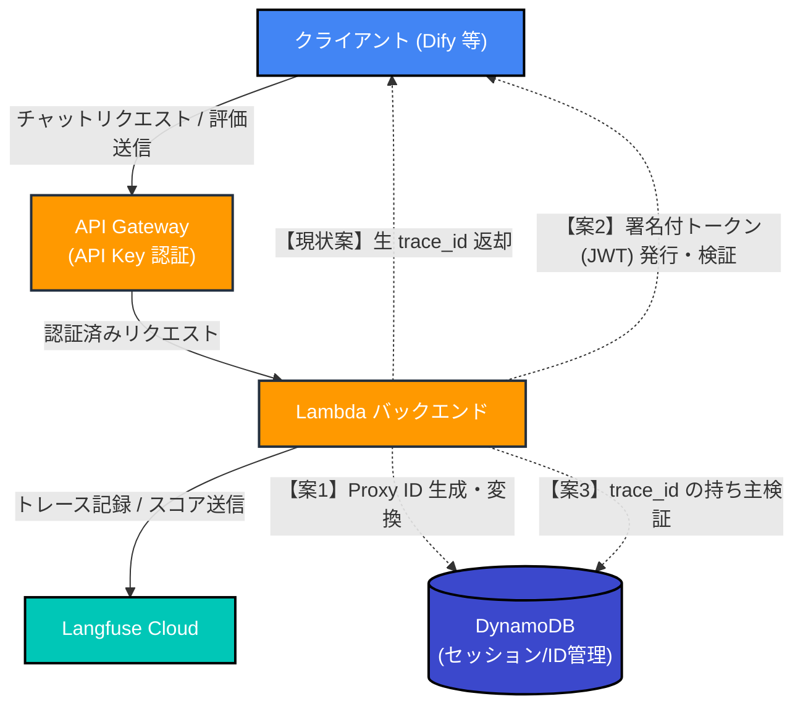
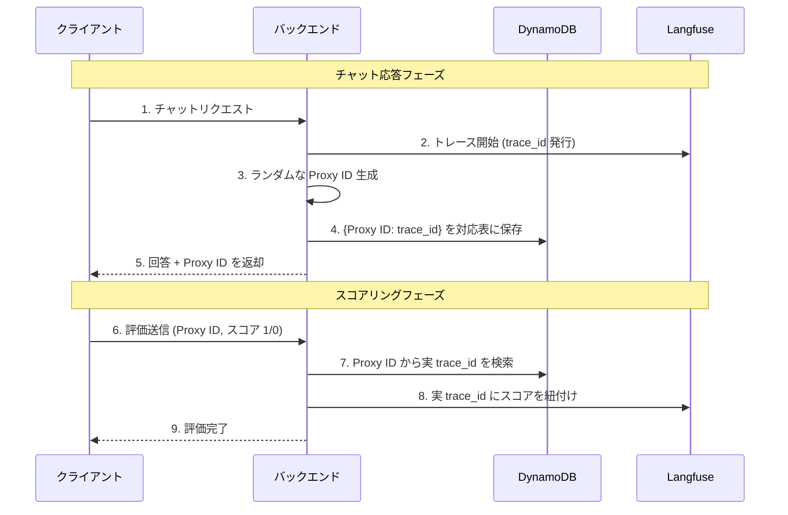
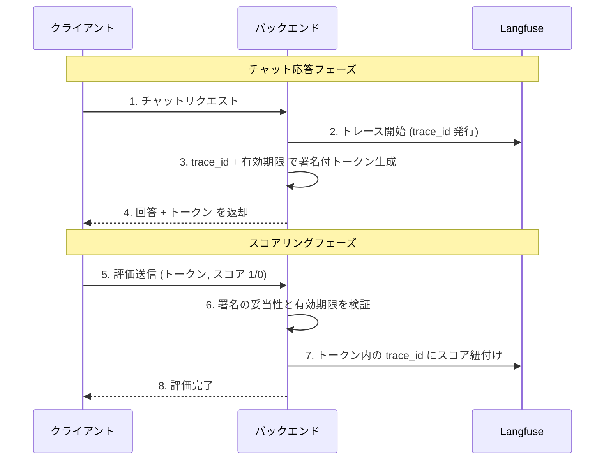
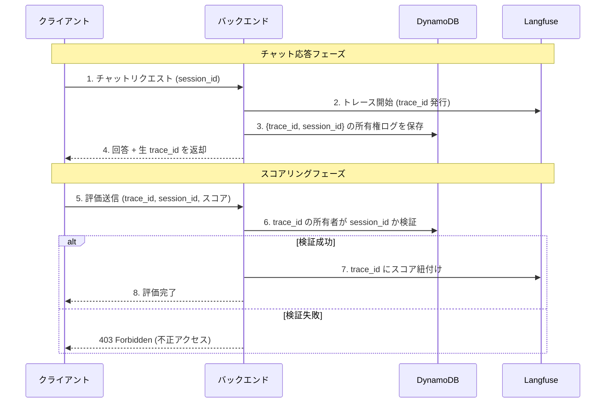

# Langfuse `trace_id` 外部公開時のセキュリティ懸念と対策

本ドキュメントは、LLMアプリケーション（Langfuse等）において、特定の実行トレースID（`trace_id`）をクライアント（フロントエンドやDify等）に返却し、評価（スコアリング）を受け付ける際のアーキテクチャ上の懸念と、その対策パターンをまとめたものです。

---

## 1. セキュリティ上の懸念

本プロジェクトのような「API Key による認証」が適用されている環境では攻撃対象が限定されますが、一般的なパブリックAPIとして設計する場合は以下のリスクが存在します。

1. **トレースデータの不正閲覧リスク（認可不備）**
   *   推測可能、あるいは漏洩した `trace_id` を使い、そのトレースに含まれるプロンプトや回答全文（他ユーザーの機密情報）を読み取るAPIエンドポイントが存在する場合の情報漏洩リスク。
2. **評価の改ざん・スパム攻撃（不正書き込み）**
   *   有効な `trace_id` を知る第三者が、大量の不正なスコア（例：意図的な「Bad」評価）を送信し、分析データを汚染するリスク。
3. **PII（個人情報）との紐付けリスク**
   *   `trace_id` 自体はUUID等の無意味な文字列でも、ユーザーIDなどと結びつくことで、個別の利用状況をトラッキングされるリスク。

---

## 2. 対策アーキテクチャ関係図

これらのリスクを軽減するために取られる主要な対策アプローチ（案1〜案3）の全体像です。

---

## 3. 対策パターンのシーケンス図

各対策方式がどのようにしてクライアントとやり取りするかを示します。

### 【案1】プロキシ ID（Short ID）方式
実際の `trace_id` を外部に出さず、一時的な別名IDのみを返却する方式です。

### 【案2】署名付きトークン（JWT）方式
DB等で状態を持たず、改ざん防止の署名を施したトークンにIDを包んで渡す方式です。スパム対策に有効です。

### 【案3】セッション紐付け検証（所有権確認）方式
ID自体は生で返すものの、評価時に「このリクエストを送ってきたユーザーは、本当にこの trace_id を発生させたユーザーか？」を検証します。

---

## 4. 本プロジェクト (Phase 6) での採用方針について
現在のハンズオン構成では、全体が **API Gateway の API Key によって保護されている閉鎖環境** であり、かつデータの「読み取り API」は外部公開していません。

そのため、過剰な複雑化（状態管理や署名検証の追加）を避ける学習的観点から、「現状案（生の `trace_id` を返却する方式）」で進めることも有効な選択肢となります。実運用を見据えたより堅牢な設計を学ぶ場合は、上記の中から用途に応じた対策を選択します。
