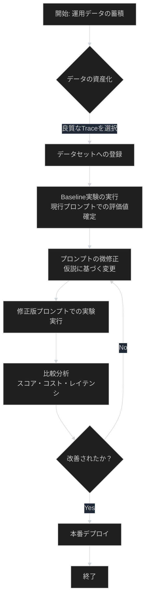

# Phase 6: データセット & 実験 (LLMOps サイクル)

本ドキュメントでは、Langfuse を活用した「プロンプト改善の PDCA サイクル」の論理構造を整理します。

## 1. 全体フローチャート

## 2. 実験実行シーケンス図

```mermaid
%%{init: {'theme': 'dark', 'themeVariables': { 'actorBkg': '#374151', 'actorTextColor': '#F3F4F6', 'actorBorder': '#D1D5DB', 'signalColor': '#D1D5DB', 'signalTextColor': '#D1D5DB', 'noteBkgColor': '#374151', 'noteTextColor': '#F3F4F6', 'noteBorderColor': '#D1D5DB' }}}%%
sequenceDiagram
    participant Supervisor as 現場監督 (User)
    participant UI as Langfuse UI
    participant Backend as AWS Lambda / Bedrock
    participant DB as Langfuse Data Store

    Note over Supervisor, DB: ステップ 1: テストデータの定義
    Supervisor->>UI: トレース一覧から有益なログを選択
    UI->>DB: Dataset Item として登録 (input/expected_output)
    DB-->>UI: 完了

    Note over Supervisor, DB: ステップ 2: 基準 (Baseline) の取得
    Supervisor->>UI: 現行プロンプトでの実験 (Run) 開始
    rect rgb(55, 65, 81)
        UI->>Backend: テストケースの入力を送信
        Backend->>UI: 回答を返却 (Generation)
    end
    UI->>DB: 実行結果とスコアを保存
    DB-->>UI: 完了

    Note over Supervisor, DB: ステップ 3: 比較実験と評価
    Supervisor->>UI: 修正プロンプトの入力
    Supervisor->>UI: 新規実験 (New Run) 開始
    rect rgb(55, 65, 81)
        UI->>Backend: 同一の入力を送信
        Backend->>UI: 修正後の回答を返却
    end
    UI->>DB: 実行結果を保存
    Supervisor->>UI: サイドバイサイド (横並び) で比較
    UI->>Supervisor: スコア、コスト、回答の差異を表示
```

## 3. 判定ロジックの要点

| ステップ | 判定項目 | 成功の定義 |
| :--- | :--- | :--- |
| **1. 資産化** | データセットの質 | 「本番で実際に起きた課題」が 2-3 件含まれていること。 |
| **2. 基準確定** | Baseline の安定性 | 現行プロンプトでの評価スコア（UI上）が固定されること。 |
| **3. 比較評価** | 改善インサイト | 「修正によって何がどう変わったか」を数値で説明できること。 |

## 4. 実務での評価自動化（LLM-as-a-Judge）のガイドライン

大規模なモデルチューニングにおいて人的コストを下げるための業界標準的なアプローチです。

### モデルケース：ハイブリッド評価パイプライン
1. **Golden Dataset の作成 (Human)**:
   - サービスを代表する 100〜200 件の「絶対に外せない」テストケースを人間が厳選。
2. **AI採点官 (LLM-as-a-Judge) の導入**:
   - 推論モデルより高性能なモデル（Claude 3.5 Sonnet 等）に、評価基準（ルーブリック）をプロンプトとして与える。
3. **キャリブレーション (Calibration)**:
   - 最初の 50 件程度を人間と AI でダブル採点し、AI の採点傾向が人間の感覚と一致するまで評価プロンプトを調整する。
4. **CI/CD 自動実行**:
   - プロンプトの微修正を push するたびに、GitHub Actions 等で全テストケースに対して AI 採点官が数分で採点を完了させる。
5. **定期的サンプリング**:
   - 運用中は 1〜5% 程度のログを人間が抜き取り検査し、AI 採点官の精度が維持されているかを監視する。
