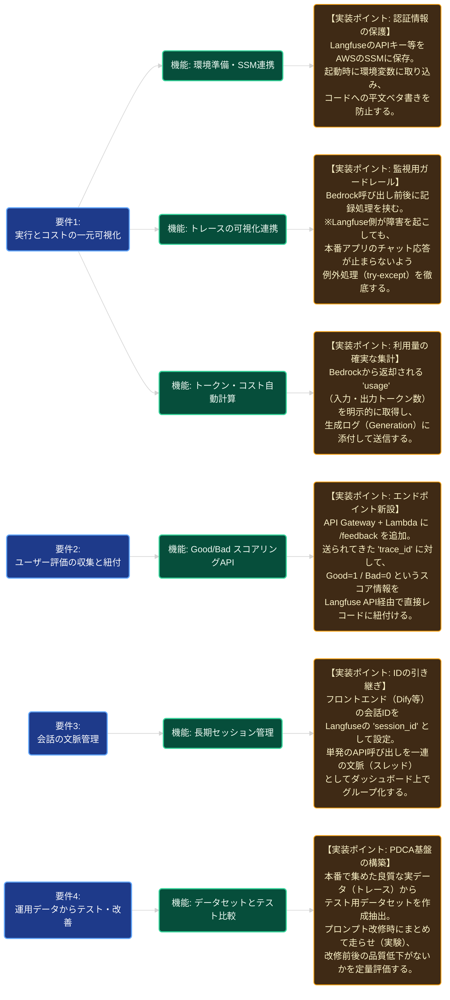

# Phase 6: 機能と実装（詳細設計）の関係図

このドキュメントは、**Phase 6: Langfuse LLMOps 品質監視** における「要件」「機能」、そしてその裏で職人（AI）がどのような意図・設計ポイントで「実装（詳細設計）」を行っているかを現場監督が俯瞰するための関係図です。
（※黒色背景のエディタで視認しやすいダークテーマを適用しています。）

### 現場監督（マネージャー）としてのチェックポイント
この図の右側のオレンジ色の枠「実装ポイント」は、**職人がコードを書くときに意識すべき要所**を表しています。
レビューやテストを行う際は、主に以下の点を確認してください。

1. **SSM・環境変数**: セキュリティ事故を防ぐため、キーがリポジトリに含まれていないか。
2. **例外処理（可用性確保）**: 監視ツールが落ちている時にサービス全体が巻き添えで落ちる設計になっていないか。
3. **正確なトレースID紐付け**: 評価API（`/feedback`）が、正しくチャット本体のIDを受け取りLangfuseに流せているか。
4. **実験による定量比較**: 感覚ではなく「データセットに基づく前後のスコア比較」ができているか。
