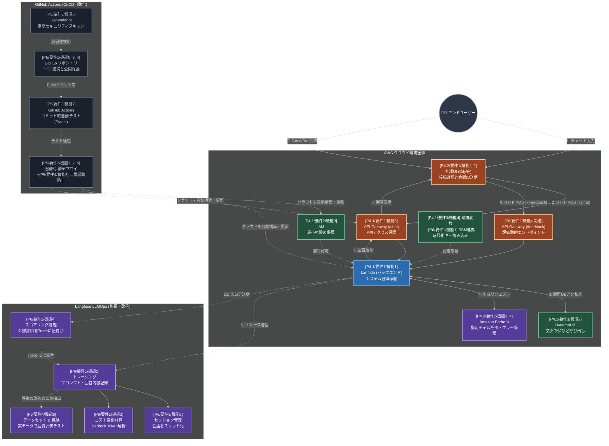

# システム全体 機能間連携プロセス図

この図は、これまでの開発（Phase 4～6）で細分化して実装してきた「個別の機能（チェックリストの項目）」が、最終的に**1つの巨大なシステムとしてどのように連携・連動して動いているか**を示すプロセス図です。

ユーザーからの入力フロー、AWS内部の処理フロー、Langfuseの監視フロー、そしてGitHubによる開発・デプロイ運用フローというプロセス全体において、各機能設計が「どの役割を担っているか」をフェーズと要件番号を付けて可視化しています。

### 図の読み解き方
*   **実線矢印（-->）**：システムが実行される際の、「主要な通信フロー」や「処理の順序（例：1～10）」です。
*   **点線矢印（-.->）**：「裏側の非同期通信（ログ転送）」や「設定・権限の反映」など、システムが依存する関係性を表しています。
*   **ブロックの記述（例：`[P4.1/要件1/機能1]`）**：このコンポーネントが、ハンズオンのどのフェーズ・要件に紐付いて実装されたかを示します。

これを見ることで、例えば「Phase 5のCI/CD要件を実装したことで、AWSだけでなくリポジトリ全体の安全性も担保されている」ことや、「Phase 6で実装した複数のLangfuse機能が、Traceを中心に集約され、最終的に『改善テスト（データセット実験）』へと結びついている」といった、**「線と面で捉えたアーキテクチャの全体像」**を意識してマネジメントできるようになります。
