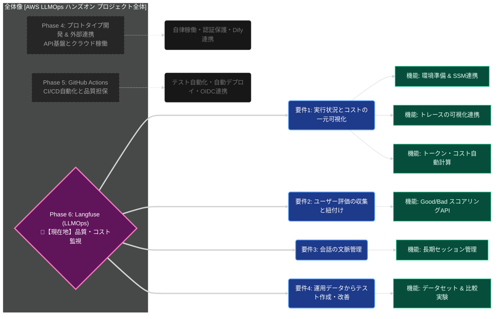

# プロジェクト全体像と現在地の把握（Phase 6）

AWS LLMOps ハンズオンの全体機能要件と、現在進行中の **Phase 6: Langfuse による品質監視** の関係性を俯瞰する関係図です。
現場監督としてシステム全体のどこを構築しているかが一目でわかるように整理しています。
（※黒色背景の環境で視認しやすいダークテーマ設定を適用しています。）

### この図の見方
- **点線・グレー要素**: 既に完了したフェーズ（Phase 4, Phase 5）における大まかな要件と機能です。
- **ピンク枠の中央要素**: 現在の全体目標である **Phase 6** です。
- **青枠の要素**: Phase 6における「4つの要件（現場監督としての要求事項）」です。
- **緑枠の要素**: それぞれの要件を満たすために（今まで、またはこれから）職人が実装する「個別の機能・設定」です。

この図をVSCode等のプレビューで表示していただくことで、いま自分が指示している作業が「全体のシステム品質を高めるためのどのピースにあたるか」を常に確認しながらマネジメントすることができます。
